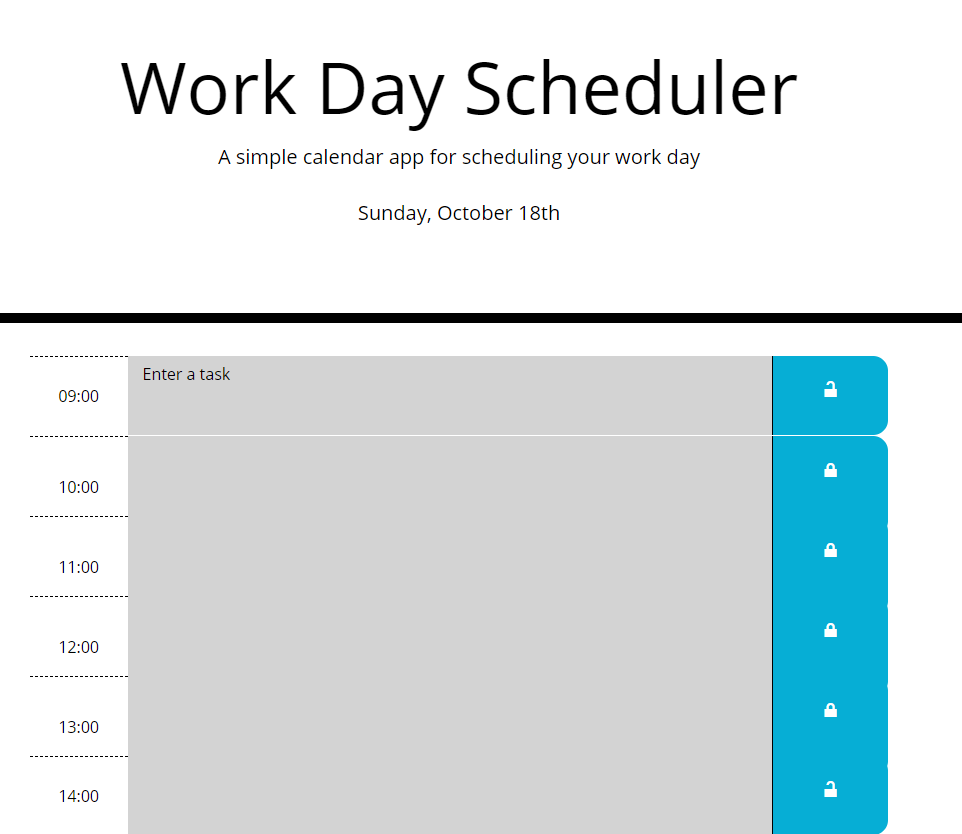

# Work Day Scheduler

## Purpose
The purpose of this app is to help people plan their work day using a browser app.  Users can plan their hours from 9-5.  Between those hours, depending on the time, the event sections will display green for upcoming events, red for events in the current hour and grey for past events.  One can enter multiple events by clicking off the event in to web page field and back to another event.  Save by clicking the lock icon, which saves to an array of objects inside localStorage.  The events will persist on the page even if the browser is closed and reopened.
 
 

Some CSS was provided. However, I set up the rows using Bootstrap.
 
 

# Built With
- HTML
- Bootstrap
- CSS
- JavaScript
- JQuery
  

# Website

[Github Pages](https://webprinc3ss.github.io/scheduler/index.html)
 

# Media

 

# Credit
Coded by webprinc3ss (me).

